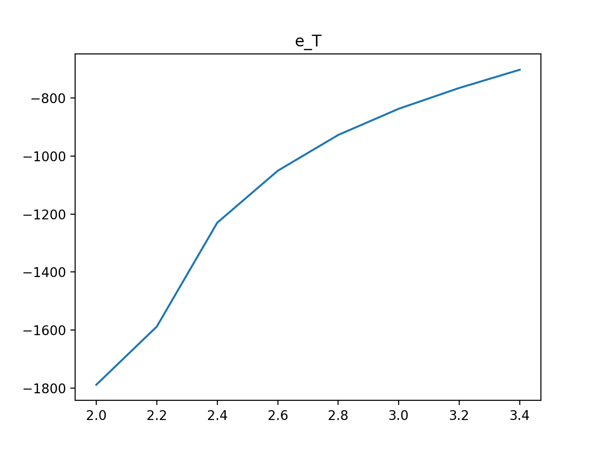
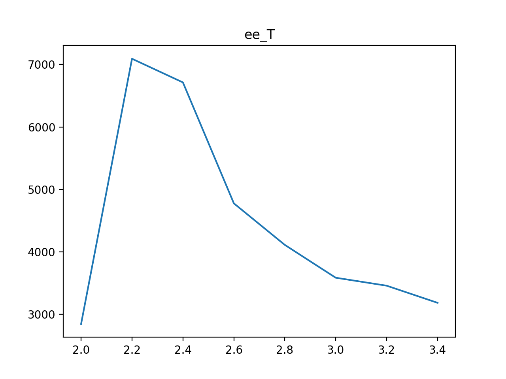
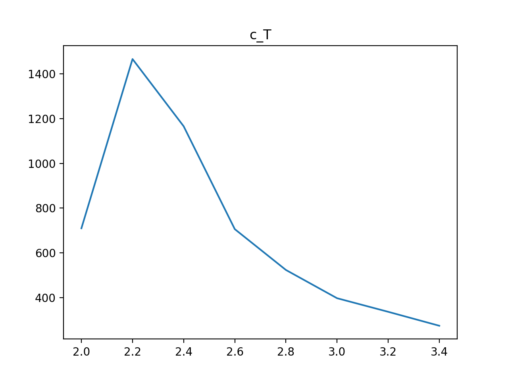
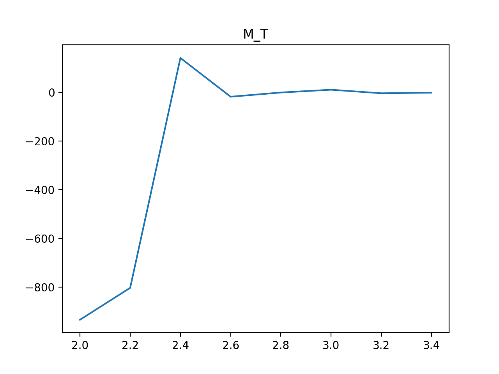
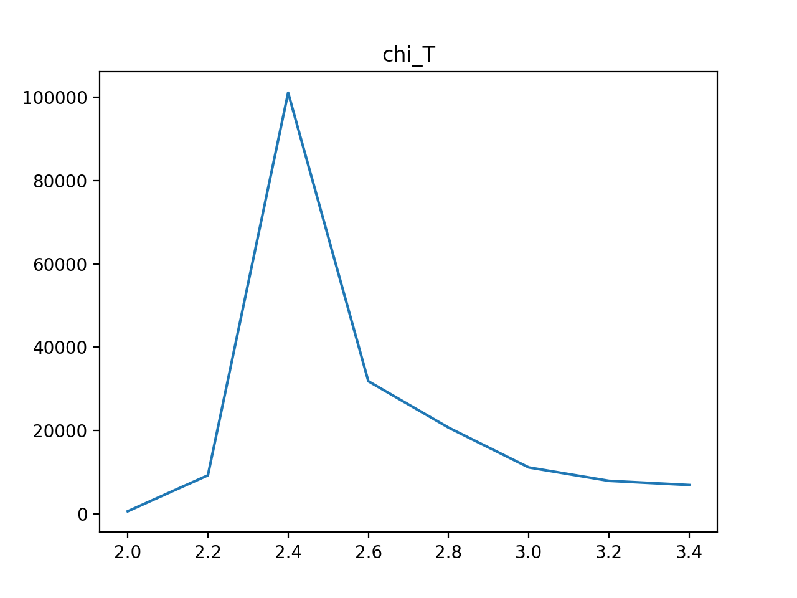
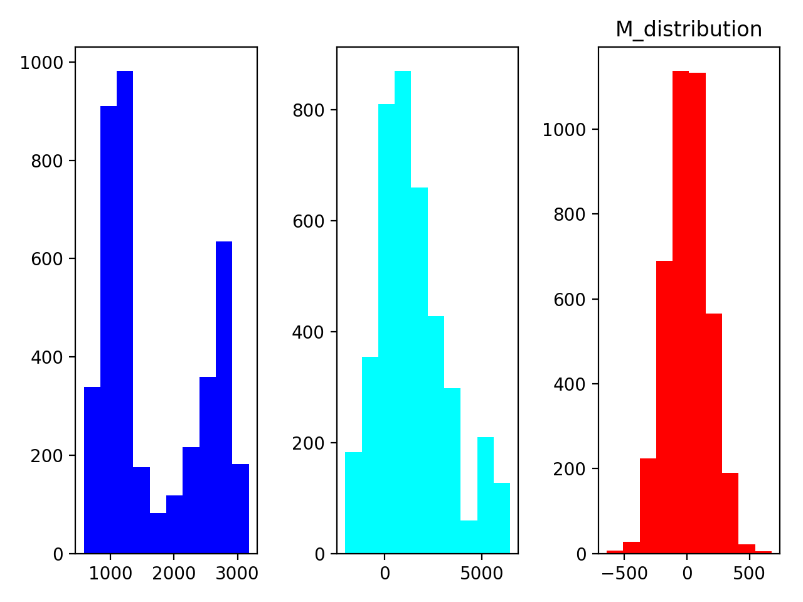

Plese compile using c++11 standard.

```
g++ IsingModel.cpp -o ising -std=c++11
```


#### E_T, C_T
32X32 spins
5000 iterations




#### M_T, chi_T
32X32 spins
5000 iterations



#### M distribution
100X100 spins
5000 iterations


